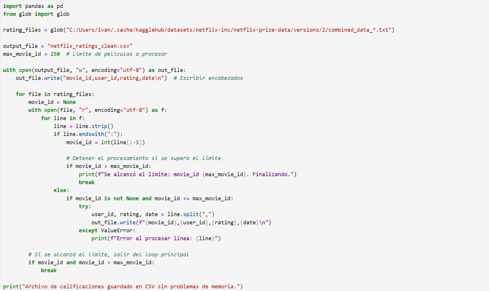
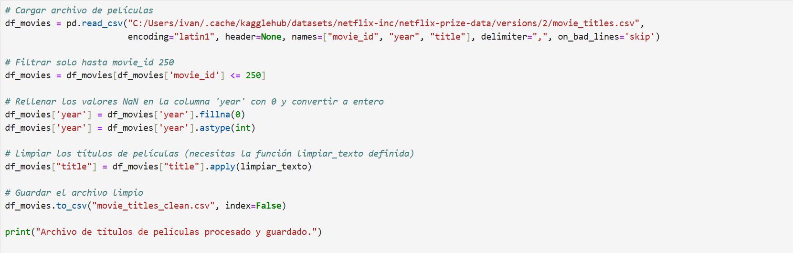
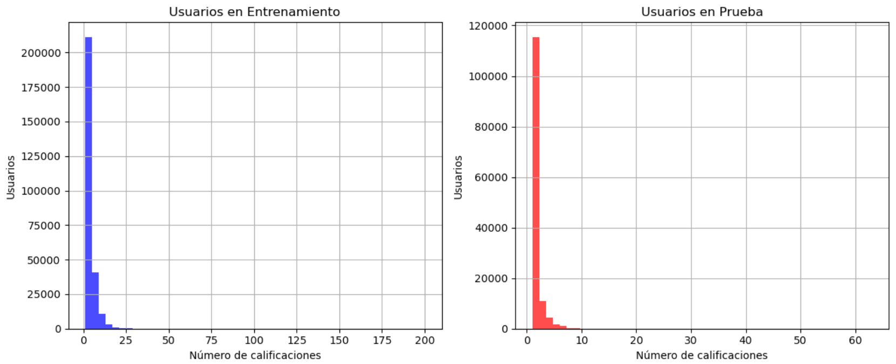
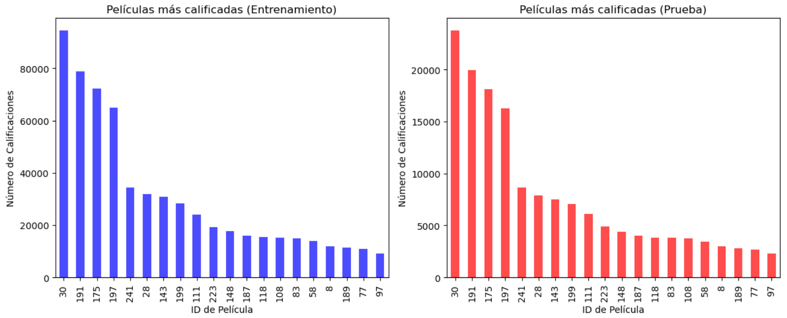
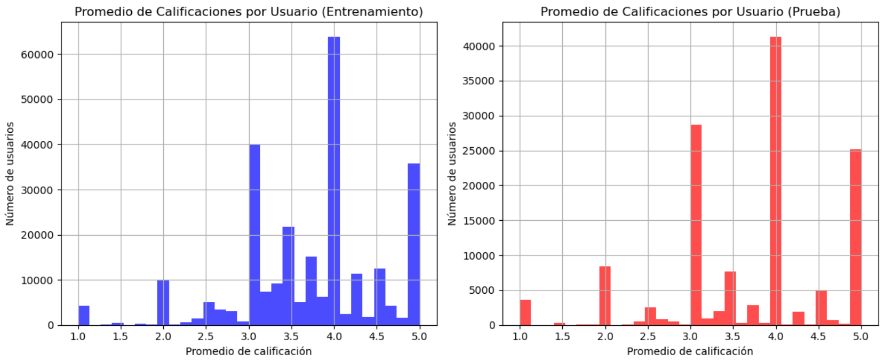
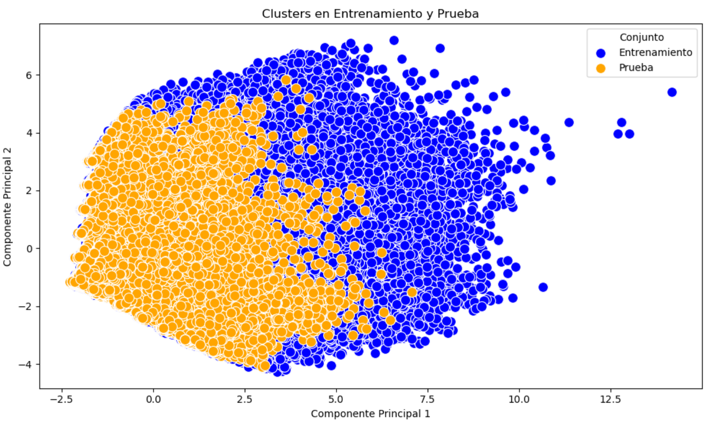

# MovieWatchIA

* Sistema de recomendación de películas basado en gustos similares.

## Tabla de contenidos
1. [Descripción](#Descripción)
2. [Arquitectura](#Arquitectura)
3. [Proceso](#Proceso)
4. [Estado del proyecto](#EstadoDelProyecto)
5. [Entorno Web](#EntornoWeb)
6. [Conclusion](#Conclusion)

# Descripción
Este proyecto consiste en una aplicación web que sugiere películas a los usuarios en función de sus preferencias personales y las de otros usuarios con gustos similares.

# EntornoWeb

# Arquitectura

# Proceso
Proceso de desarrollo:

- Fuente del dataset
https://www.kaggle.com/datasets/netflix-inc/netflix-prize-data/data

- Limpieza de datos

- Estadísticos

# EstadoDelProyecto
El sistema de recomendación está completamente funcional y ofrece sugerencias de películas personalizadas basadas en las preferencias de los usuarios. Aunque se han identificado áreas para mejorar la precisión y optimización del modelo, no se tiene previsto implementarlas en el corto plazo. Actualmente, se ha desarrollado un sitio web donde los usuarios pueden ingresar su ID para recibir recomendaciones de películas de manera personalizada.

# Conclusion
El sistema de recomendación desarrollado ofrece sugerencias de películas personalizadas según las preferencias de los usuarios, brindando una experiencia única. Aunque el modelo es funcional y cumple su objetivo, existen oportunidades para mejorar la precisión de las recomendaciones y optimizar el algoritmo.
